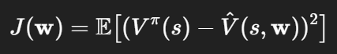

1. Mục tiêu

- Học cách ước lượng hàm giá trị V^π(s) khi số lượng trạng thái rất lớn hoặc liên tục – không thể dùng bảng giá trị truyền thống.

- Áp dụng hàm tham số thay cho bảng để xấp xỉ giá trị trạng thái.

- Khám phá cách dùng giải thuật gradient descent để tối ưu mục tiêu học (value error).

2. Nội dung chính

 2.1. Giới thiệu hàm xấp xỉ (function approximation)
  - Parameterized value function: sử dụng vector tham số 𝑤 để xấp xỉ V^(s,w).
  - Mục tiêu là tìm w tối ưu sao cho sai số giữa V^(s) và giá trị thật nhỏ.
 
 2.2 Định nghĩa mục tiêu học
  - Value error objective: 
  - Mục tiêu là giảm thiểu J(w) qua truy cập dữ liệu trải nghiệm.

 2.3. Áp dụng Gradient Monte Carlo

 - Sử dụng ước lượng Monte Carlo Gt và cập nhật theo: 
 - Cập nhật khi có episode kết thúc, offline hoặc online.

 2.4. Semi-gradient TD

 - Sử dụng bootstrap để cập nhật ngay sau mỗi bước, dựa vào phần thưởng và giá trị giả định kế tiếp: 
 - Không yêu cầu mô hình môi trường, chỉ cần quan sát trực tiếp các mẫu.

 2.5. Phân tích so sánh

 - TD vs. Monte Carlo: 
   TD: cập nhật sau mỗi bước, hội tụ nhanh, bootstrapping.
   MC: cập nhật cuối tập, nhưng ổn định hơn do không sử dụng bootstrap.

 - Cả hai cho phép generalization nhờ function approximation – phù hợp với không gian trạng thái lớn hoặc liên tục.

 2.6. Case study và thực hành
 - Triển khai state aggregation hoặc linear function với TD để ước lượng V^π(s)
 - Làm quen với bài tập lập trình: "Semi-gradient TD(0) with State Aggregation" (~120 phút).

3. Kết luận. 
 - Chủ đề bài học: On-policy prediction với function approximation – sự kết hợp giữa TD learning và supervised learning.
 - Semi-gradient TD là kỹ thuật thiết yếu để học từ môi trường phức tạp – không gian vô hạn hoặc liên tục.
 - Gradient descent và Monte Carlo methods được dùng để tối ưu hóa hàm ước lượng.
 - Phần thực hành giúp thiết lập giá trị xấp xỉ bằng phân nhóm trạng thái.
 - Hiểu rõ ưu nhược của các phương pháp cập nhật giá trị trong môi trường phức tạp.